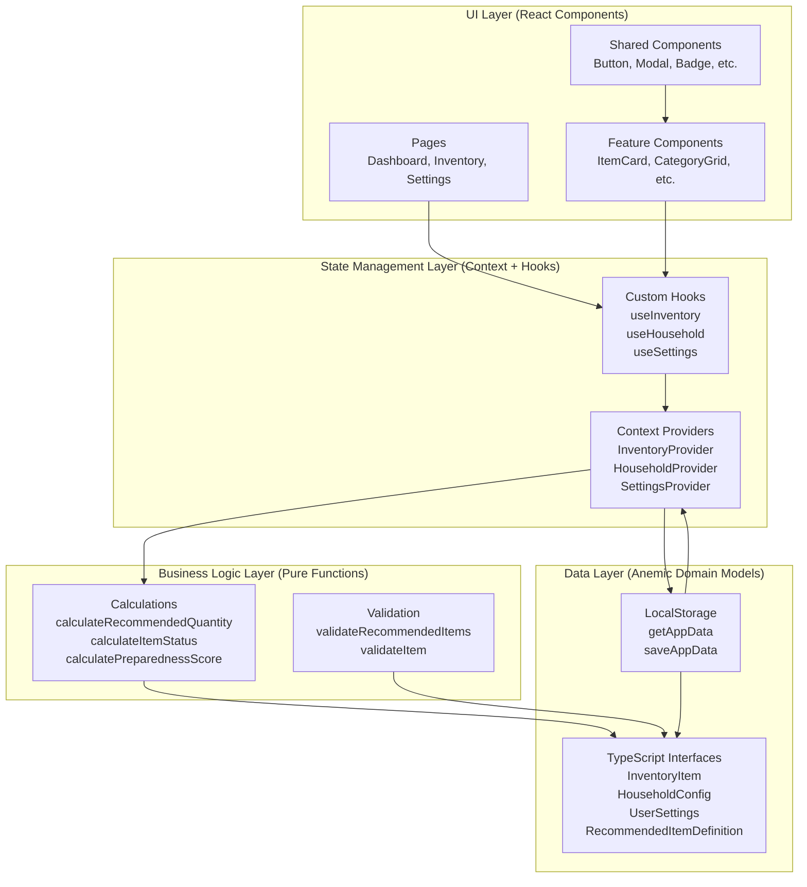
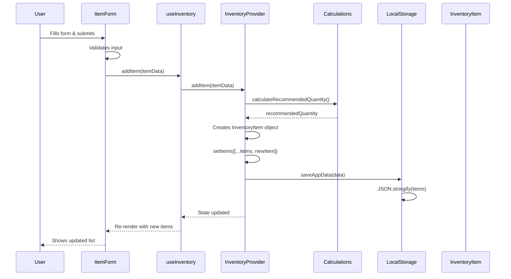
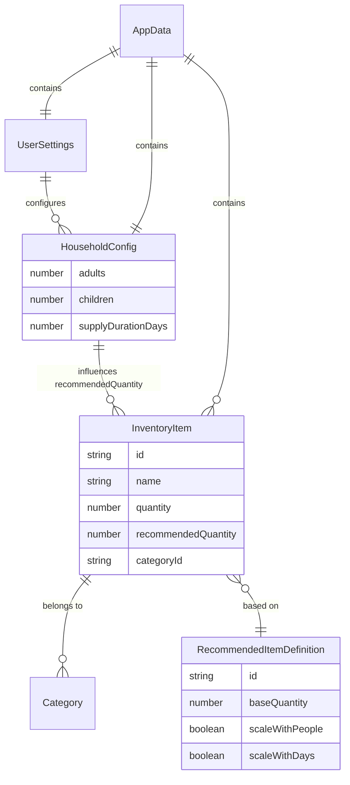

# Application Architecture

> **Version:** 2.1.0
> **Last Updated:** 2026-01-15
> **Source of Truth:** `src/features/`, `src/shared/`

This document describes the complete architecture of the Emergency Supply Tracker application, including the layered architecture, feature slice organization, component structure, and data flow.

---

## Architecture Overview

The application follows a **layered architecture** with **feature slice organization** and **anemic domain models**:

- **Anemic Domain Models**: Plain TypeScript interfaces (data only, no behavior)
- **Business Logic**: Pure utility functions (separated from data)
- **State Management**: React Context API (manages state and persistence)
- **UI Layer**: React components organized by feature slices
- **Feature Slices**: Self-contained features with components, hooks, utils, and state

---

## High-Level Architecture



---

## Feature Slice Architecture

The application is organized using **Feature Slice Architecture**, where each feature is self-contained with its own components, hooks, utilities, and state management.

### Directory Structure

```
src/
├── features/              # Feature slices (domain-driven)
│   ├── alerts/
│   │   ├── components/    # AlertBanner, HiddenAlerts
│   │   ├── utils/         # Alert generation logic
│   │   ├── types.ts       # Alert-specific types
│   │   └── index.ts       # Public API
│   ├── dashboard/
│   │   ├── components/    # CategoryCard, CategoryGrid, DashboardHeader
│   │   ├── utils/         # Preparedness calculations
│   │   └── index.ts
│   ├── household/
│   │   ├── components/    # (if any)
│   │   ├── hooks/         # useHousehold
│   │   ├── utils/         # Household calculations
│   │   ├── context.ts     # HouseholdContext
│   │   ├── provider.tsx   # HouseholdProvider
│   │   └── index.ts
│   ├── inventory/
│   │   ├── components/    # ItemCard, ItemForm, ItemList, etc.
│   │   ├── hooks/         # useInventory
│   │   ├── utils/         # Status calculations
│   │   ├── context.ts      # InventoryContext
│   │   ├── provider.tsx   # InventoryProvider
│   │   └── index.ts
│   ├── settings/
│   │   ├── components/    # Settings form components
│   │   ├── hooks/         # useSettings
│   │   ├── context.ts      # SettingsContext
│   │   ├── provider.tsx   # SettingsProvider
│   │   └── index.ts
│   ├── onboarding/
│   │   ├── components/    # Onboarding flow components
│   │   └── index.ts
│   ├── templates/
│   │   ├── components/    # TemplateSelector
│   │   ├── data.ts        # Recommended item definitions
│   │   └── index.ts
│   ├── categories/
│   │   ├── data.ts        # Category definitions
│   │   └── index.ts
│   └── help/
│       ├── components/    # Help page components
│       └── index.ts
│
├── shared/                # Shared code across features
│   ├── components/        # Reusable UI primitives
│   │   ├── Badge/
│   │   ├── Button/
│   │   ├── Modal/
│   │   ├── Navigation/
│   │   └── ...
│   ├── hooks/             # Shared hooks
│   │   └── useKeyboardNavigation
│   ├── utils/             # Shared utilities
│   │   ├── calculations/  # Pure calculation functions
│   │   ├── storage/       # LocalStorage operations
│   │   └── validation/    # Validation functions
│   ├── types/             # Shared TypeScript types
│   └── contexts/          # Shared contexts (if any)
│
└── [No pages/ directory]   # Pages are in features/*/pages/
```

### Feature Structure Template

Each feature follows this structure:

```
features/{feature-name}/
├── components/          # Feature-specific components
│   ├── ComponentName/
│   │   ├── ComponentName.tsx
│   │   ├── ComponentName.module.css
│   │   ├── ComponentName.test.tsx
│   │   ├── ComponentName.stories.tsx
│   │   └── index.ts
│   └── index.ts        # Re-export all components
├── hooks/              # Feature-specific hooks
│   ├── useFeatureHook.ts
│   └── index.ts
├── utils/              # Feature-specific utilities
│   ├── utility.ts
│   ├── utility.test.ts
│   └── index.ts
├── types.ts            # Feature-specific types
├── context.ts          # Context definition (if needed)
├── provider.tsx        # Provider component (if needed)
└── index.ts            # Public API exports
```

### Public API Pattern

Each feature's `index.ts` exports only the public API:

```typescript
// features/inventory/index.ts

// Components
export { ItemList } from './components/ItemList';
export { ItemForm } from './components/ItemForm';

// Hooks
export { useInventory } from './hooks/useInventory';

// Context/Provider
export { InventoryProvider } from './provider';
export type { InventoryContextValue } from './context';

// Types
export type { InventoryItem } from './types';

// Utils (if needed externally)
export { calculateItemStatus } from './utils/status';
```

---

## Layer Details

### 1. Data Layer (Anemic Domain Models)

**Location:** `src/shared/types/index.ts`, `src/features/*/types.ts`

**What it is:**

- Plain TypeScript interfaces
- No methods, only data properties
- Serializable to JSON

**Key Models:**

```typescript
interface InventoryItem {
  id: string;
  name: string;
  quantity: number;
  recommendedQuantity: number;
  categoryId: string;
  // ... more fields
}

interface HouseholdConfig {
  adults: number;
  children: number;
  supplyDurationDays: number;
  useFreezer: boolean;
}

interface UserSettings {
  language: 'en' | 'fi';
  theme: 'light' | 'dark' | 'auto';
  // ... more fields
}
```

**Connections:**

- Used by: Business Logic, Context Providers, LocalStorage
- Created by: Context Providers (when user adds/updates)
- Stored by: LocalStorage (JSON serialization)

---

### 2. Business Logic Layer (Pure Functions)

**Location:** `src/shared/utils/calculations/`, `src/features/*/utils/`

**What it is:**

- Pure functions (no side effects)
- Operate on anemic domain models
- Stateless calculations

**Business Logic Location Pattern:**

- **Cross-feature utilities** (used by 2+ features) → `src/shared/utils/calculations/`
  - `calculateRecommendedQuantity()` - used by inventory, onboarding, dashboard
  - `calculateHouseholdMultiplier()` - used by inventory, dashboard
  - `calculateItemStatus()` - used by inventory, dashboard, alerts
  - `getStatusFromPercentage()` - used by inventory, dashboard
  - `getDaysUntilExpiration()` - used by inventory, alerts
  - `calculateCategoryPercentage()` - unified category completion percentage (used by dashboard, alerts)
  - Water calculations, calorie calculations

- **Feature-specific utilities** (used by single feature) → `src/features/{feature}/utils/`
  - Dashboard: `calculatePreparednessScore()`, `calculateCategoryStatus()`, `backupReminder()`
  - Inventory: (status calculations moved to shared, but feature-specific logic stays)
  - Alerts: alert generation logic

**Key Functions:**

```typescript
// Cross-feature calculations (shared/utils/calculations/)
calculateRecommendedQuantity(item, household): number
calculateHouseholdMultiplier(household): number
calculateItemStatus(item): ItemStatus
getItemStatus(quantity, recommended, expiration): ItemStatus
getStatusFromPercentage(percentage): ItemStatus
getDaysUntilExpiration(expirationDate): number | undefined
isItemExpired(expirationDate): boolean
calculateCategoryPercentage(categoryId, items, household, ...): CategoryPercentageResult  // Unified category percentage

// Feature-specific calculations (features/*/utils/)
calculatePreparednessScore(items, household): number  // Dashboard
calculateCategoryStatus(category, items, ...): CategoryStatusSummary  // Dashboard
```

**Connections:**

- Input: Anemic domain models (InventoryItem, HouseholdConfig)
- Output: Calculated values (numbers, status, etc.)
- Called by: Context Providers, UI Components

---

### 3. State Management Layer (Context + Hooks)

**Location:** `src/features/*/provider.tsx`, `src/features/*/hooks/`

**What it is:**

- React Context Providers (manage state)
- Custom hooks (access context)
- Bridge between UI and data

**Key Providers:**

| Provider            | Manages                                          | Actions                                     | Location                          |
| ------------------- | ------------------------------------------------ | ------------------------------------------- | --------------------------------- |
| `InventoryProvider` | `items[]`, `categories[]`, `dismissedAlertIds[]` | `addItem()`, `updateItem()`, `deleteItem()` | `features/inventory/provider.tsx` |
| `HouseholdProvider` | `household` (HouseholdConfig)                    | `updateHousehold()`                         | `features/household/provider.tsx` |
| `SettingsProvider`  | `settings` (UserSettings)                        | `updateSettings()`                          | `features/settings/provider.tsx`  |

**Custom Hooks:**

| Hook                    | Purpose                      | Location                    |
| ----------------------- | ---------------------------- | --------------------------- |
| `useInventory()`        | Access inventory context     | `features/inventory/hooks/` |
| `useHousehold()`        | Access household context     | `features/household/hooks/` |
| `useSettings()`         | Access settings context      | `features/settings/hooks/`  |
| `useBackupTracking()`   | Manage backup reminder state | `features/dashboard/hooks/` |
| `useDashboardAlerts()`  | Manage dashboard alerts      | `features/dashboard/hooks/` |
| `useCategoryStatuses()` | Calculate category statuses  | `features/dashboard/hooks/` |
| `useLocalStorageSync()` | Sync state with localStorage | `shared/hooks/`             |

**Connections:**

- Reads from: LocalStorage (on mount)
- Writes to: LocalStorage (on state change)
- Uses: Business logic functions (for calculations)
- Provides: State and actions to UI via hooks

---

### 4. UI Layer (React Components)

**Location:** `src/features/*/pages/`, `src/features/*/components/`, `src/shared/components/`

**What it is:**

- React components (presentation)
- User interaction handlers
- Uses hooks to access state

**Component Hierarchy:**

```
App
├── ErrorBoundary
├── SettingsProvider
├── HouseholdProvider
├── InventoryProvider
└── AppContent
    ├── Navigation
    └── [Page Content]
        │
        ├── Dashboard (features/dashboard/pages/Dashboard.tsx)
        │   ├── DashboardHeader
        │   ├── AlertBanner
        │   └── CategoryGrid
        │       └── CategoryCard[]
        │
        ├── Inventory (features/inventory/pages/Inventory.tsx)
        │   ├── CategoryNav
        │   ├── FilterBar
        │   ├── CategoryStatusSummary
        │   └── ItemList
        │       └── ItemCard[]
        │
        └── Settings (features/settings/pages/Settings.tsx)
            ├── HouseholdForm
            ├── NutritionSettings
            ├── LanguageSelector
            ├── ThemeSelector
            └── [Other settings components]
```

**Shared Components:**

Reusable building blocks in `src/shared/components/`:

| Component          | Description                      | Usage                      |
| ------------------ | -------------------------------- | -------------------------- |
| `AllProviders`     | Combines all context providers   | App root wrapper           |
| `Badge`            | Status badge with color variants | Status indicators          |
| `Button`           | Primary action button            | Actions throughout app     |
| `Card`             | Container card                   | Content containers         |
| `ConfirmDialog`    | Confirmation dialog              | Delete/destructive actions |
| `DocumentMetadata` | Manages document title/meta      | SEO and page titles        |
| `ErrorBoundary`    | Error boundary wrapper           | Error handling             |
| `Input`            | Text input field                 | Forms                      |
| `LanguageSwitcher` | Language selection dropdown      | i18n language toggle       |
| `Modal`            | Dialog overlay                   | Forms, confirmations       |
| `Navigation`       | Bottom/side navigation tabs      | Main navigation            |
| `NotificationBar`  | Notification container           | System notifications       |
| `NotificationItem` | Individual notification          | Alert messages             |
| `Select`           | Dropdown select                  | Form inputs                |
| `Toast`            | Toast notification               | Temporary messages         |
| `Tooltip`          | Hover tooltip                    | Contextual help            |

**Connections:**

- Uses: Custom hooks (useInventory, useHousehold, useSettings)
- Calls: Context actions (addItem, updateItem, etc.)
- Displays: Data from context state
- Triggers: Business logic via context actions

---

## Data Flow

### Adding an Item Flow



### Dashboard Load Flow

```mermaid
graph TD
    Start[User opens Dashboard] --> Load[App.tsx renders]
    Load --> Providers[Context Providers mount]
    Providers --> LS1[LocalStorage.getAppData]
    LS1 --> Parse[JSON.parse data]
    Parse --> Models[Create InventoryItem[], HouseholdConfig, UserSettings objects]
    Models --> State[Providers setState with models]
    State --> Hook[useInventory, useHousehold hooks]
    Hook --> Page[Dashboard component]
    Page --> Calc1[calculatePreparednessScore items, household]
    Calc1 --> Calc2[calculateCategoryStatus for each category]
    Calc2 --> Calc3[calculateItemStatus for each item]
    Calc3 --> Display[Render DashboardHeader, CategoryGrid, AlertBanner]
    Display --> User[User sees dashboard]
```

---

## Key Architectural Patterns

### 1. Anemic Domain Model Pattern

**Data (Interfaces):**

```typescript
interface InventoryItem {
  id: string;
  quantity: number;
  // ... data only
}
```

**Behavior (Functions):**

```typescript
function calculateItemStatus(item: InventoryItem): ItemStatus {
  // Logic here
}
```

**Why:** Separates data from behavior, making data easy to serialize and functions easy to test.

---

### 2. Context Provider Pattern

**Provider manages:**

- State (React useState)
- Persistence (LocalStorage sync)
- Business logic calls (calculations)

**Example:**

```typescript
function InventoryProvider({ children }) {
  const [items, setItems] = useState(() => getAppData()?.items || []);

  // Auto-save on change
  useEffect(() => {
    saveAppData({ ...data, items });
  }, [items]);

  const addItem = (itemData) => {
    const recommendedQty = calculateRecommendedQuantity(itemData, household);
    const newItem = { ...itemData, recommendedQuantity: recommendedQty };
    setItems([...items, newItem]);
  };

  return <InventoryContext.Provider value={{ items, addItem }}>...</InventoryContext.Provider>;
}
```

---

### 3. Hook Pattern

**Hooks provide:**

- Access to context
- Error handling (throws if outside provider)
- Type safety

**Example:**

```typescript
function useInventory() {
  const context = useContext(InventoryContext);
  if (!context) throw new Error('Must be within InventoryProvider');
  return context;
}
```

---

### 4. Feature Slice Pattern

**Each feature is self-contained:**

- Own components (UI)
- Own hooks (state access)
- Own utils (business logic)
- Own types (data models)
- Own context/provider (state management)

**Benefits:**

- Clear boundaries between features
- Easy to locate feature code
- Reduced coupling between features
- Easier to test in isolation

---

## Data Relationships



---

## Component Patterns

### File Structure

Each component follows this structure:

```
features/{feature}/components/
├── ComponentName/
│   ├── ComponentName.tsx         # Main component
│   ├── ComponentName.module.css  # Styles
│   ├── ComponentName.test.tsx    # Tests
│   └── ComponentName.stories.tsx # Storybook stories
└── index.ts                      # Component exports
```

### Props Pattern

```typescript
interface ComponentNameProps {
  // Required props
  requiredProp: string;

  // Optional props with defaults
  optionalProp?: boolean;

  // Event handlers
  onAction?: () => void;

  // Children
  children?: React.ReactNode;
}
```

---

## Styling

- **CSS Modules** for component-scoped styles
- Theme-aware colors via CSS custom properties
- Responsive design with mobile-first approach
- Consistent spacing using design tokens

---

## Accessibility

The application implements comprehensive accessibility features following WCAG 2.1 guidelines.

### Semantic HTML

- **Skip Link**: "Skip to main content" link at page start
- **Landmarks**: Proper use of `<main>`, `<nav>`, `<header>`, `<section>`
- **Headings**: Correct heading hierarchy (h1 > h2 > h3)
- **Forms**: All form inputs have associated `<label>` elements
- **Dynamic Language**: The `lang` attribute on `<html>` updates based on selected language

### ARIA Attributes

| Attribute             | Usage                                  |
| --------------------- | -------------------------------------- |
| `aria-label`          | Navigation elements, icon-only buttons |
| `aria-current="page"` | Active navigation items                |
| `aria-modal="true"`   | Modal dialogs                          |
| `aria-labelledby`     | Modal title associations               |
| `aria-invalid`        | Form validation errors                 |
| `aria-describedby`    | Error messages and helper text         |

### Keyboard Navigation

| Key                | Action                                     |
| ------------------ | ------------------------------------------ |
| `Tab`              | Move focus to next interactive element     |
| `Shift + Tab`      | Move focus to previous interactive element |
| `Enter` / `Space`  | Activate buttons and links                 |
| `Escape`           | Close modals and dialogs                   |
| `Arrow Left/Right` | Navigate between tabs                      |

### Focus Management

- **Focus Indicators**: All interactive elements have visible focus states
- **Focus Trap**: Modal dialogs trap focus within the dialog
- **Focus Restoration**: When modals close, focus returns to the opening element
- **High Contrast Mode**: Toggle available in Settings > Appearance

---

## Summary

**How the Architecture Works:**

1. **Data Layer** (Interfaces) → Stored in LocalStorage as JSON
2. **Business Logic** (Functions) → Operates on interfaces, returns calculated values
3. **State Management** (Context) → Holds interfaces in React state, calls business logic
4. **UI Layer** (Components) → Uses hooks to access state, displays data, triggers actions

**Key Insights:**

- **Anemic Domain Models** are passive data structures that flow through the application
- **Feature Slices** organize code by domain, making it easy to locate and maintain
- **Business Logic** lives in separate utility functions, not in the models themselves
- **Context Providers** bridge between UI and data, managing state and persistence

---

## References

- [DATA_SCHEMA.md](./DATA_SCHEMA.md) - Data structure definitions
- [FUNCTIONAL_SPEC.md](./FUNCTIONAL_SPEC.md) - Functional requirements
- [DESIGN_DOCS_INDEX.md](./DESIGN_DOCS_INDEX.md) - Design documents
- [REFACTORING_QUICK_START.md](./plans/REFACTORING_QUICK_START.md) - Feature slice migration guide
